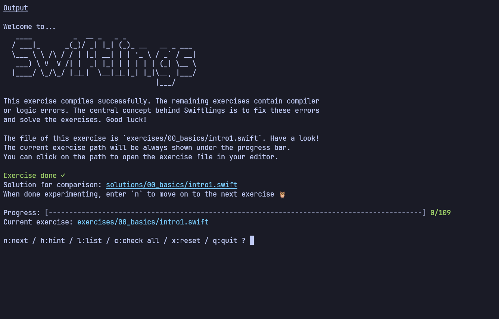

# swiftlings-linux

Small exercises to learn Swift, in the style of
[Rustlings](https://github.com/rust-lang/rustlings), that run with the
open-source Swift toolchain on Linux with no Mac or Xcode required. The exercises
teach Swift the language, so the "-linux" is about the toolchain and runner, not
Linux-specific content. You fix one broken file at a time; the runner recompiles
it on save and moves you forward when it passes. Each exercise links to the
matching chapter of
[The Swift Programming Language](https://docs.swift.org/swift-book/).

This is a fork of [Swiftlings](https://github.com/tornikegomareli/swiftlings) by
Tornike Gomareli, which assumes macOS and Xcode. The exercises and the runner
come from there. What this fork adds is making the whole thing build and run on
Linux.



## Why Swift on Linux

Swift is not only for Apple platforms, and most people who reach for it on Linux
are not writing iOS apps. Common reasons:

- **Server-side Swift.** Frameworks like Vapor and Hummingbird run on Linux. If
  you write Swift backends, they are built, tested, and deployed on Linux,
  usually inside containers.
- **Contributing to Swift itself.** The compiler, standard library, Foundation,
  and the package manager are all developed and tested on Linux. Learning the
  language on Linux is a natural first step toward working on the toolchain.
- **No Mac needed.** Swift is worth learning on its own, and you do not need
  Apple hardware to do it. Students and anyone on a Linux machine can start here.
- **CI/CD.** Swift continuous integration runs in Linux containers (the official
  `swift` Docker images). Knowing the Linux toolchain helps when a build behaves
  differently from a Mac.
- **Cross-platform reach.** Swift targets Linux, Windows, and embedded systems.
  Learning it outside Xcode keeps the focus on the language rather than the IDE.

## Prerequisites

- Swift 6.x, installed from [swift.org](https://www.swift.org/install/linux/)

Check your toolchain:

```sh
swift --version
```

## Quick start

```sh
git clone https://github.com/lucasly-ba/swiftlings-linux.git
cd swiftlings-linux
make install
swiftlings
```

`make install` builds a release binary and puts `swiftlings` in `~/.local/bin`,
so make sure that is on your `PATH`. Then `swiftlings` starts the watcher. If you
would rather not install anything, run it straight from the repo with
`swift run swiftlings`.

## How it works

Open the first unsolved exercise. It has a `// TODO` and a compiler or logic
error. Fix it and save. In watch mode the runner recompiles and reruns the file
automatically. An exercise is solved once it compiles and all of its checks pass,
and you move on to the next one.

## Commands

While watching, the runner reads these keys:

| Key | What it does                                     |
| --- | ------------------------------------------------ |
| `n` | Move on to the next exercise once it passes      |
| `h` | Show a hint                                      |
| `l` | List every exercise and your progress            |
| `c` | Check all exercises                              |
| `x` | Reset the current exercise to its starting state |
| `q` | Quit                                             |

## Topics

The exercises go from the basics to the deeper parts of the language:

1. `00_basics`
2. `01_control_flow`
3. `02_strings_and_characters`
4. `03_collections`
5. `04_functions`
6. `05_closures`
7. `06_optionals`
8. `07_structs`
9. `08_classes`
10. `09_initialization`
11. `10_enums`
12. `11_properties`
13. `12_protocols`
14. `13_extensions`
15. `14_generics`
16. `15_error_handling`
17. `16_memory_management`
18. `17_codable`
19. `18_property_wrappers`
20. `19_concurrency`
21. `20_result_builders`
22. `21_advanced_types`

Each topic folder has a `README.md` with a short explanation and links to the
official docs.

### Bonus track

After the numbered topics there is `dsa_queue`, a small data-structures track
that builds a FIFO queue from scratch, from a basic struct up to `Collection`
conformance. It is not part of the numbered language curriculum.

## Credits

- [Swiftlings](https://github.com/tornikegomareli/swiftlings) by Tornike
  Gomareli: the original Swift runner and exercises this is built on (MIT).
- [Rustlings](https://github.com/rust-lang/rustlings): the Rust project that
  started the idea (MIT).

## License

MIT. See [LICENSE](LICENSE).
